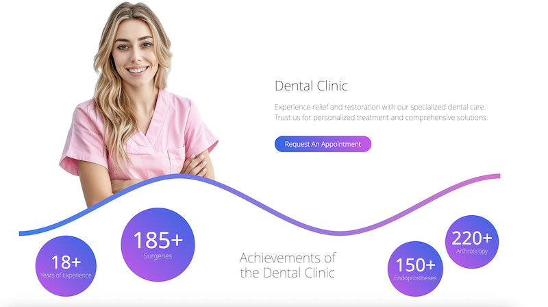

# Dental: Cutting-Edge Dental Clinic Website 🦷✨

Welcome to Dental – a modern and comprehensive website solution tailored for dental clinics. Built on Next.js, Dental is designed to provide a seamless user experience with a focus on search engine optimization, multi-language support, and an intuitive content management system (CMS).

## Overview

Dental is a Next.js-powered website built specifically for dental clinics looking to enhance their online presence. The site features a detailed list of services, an engaging gallery, patient reviews, and a full contact information page. Designed with search engines in mind, Dental ensures that your clinic is easily discoverable online. The built-in CMS allows for effortless content management, making it easy to update and expand the site’s offerings. Dental's multi-language capability ensures that you can cater to a diverse clientele with minimal effort.

## Features

- **Comprehensive Service Listings:** Showcase your clinic's services with detailed descriptions, allowing potential patients to easily find the treatments they need.
- **Interactive Gallery:** Display high-quality images of your clinic, staff, and facilities, enhancing trust and engagement with visitors.
- **Patient Reviews:** Feature authentic patient testimonials to build credibility and attract new clients.
- **Advanced Contact Page:** Provide complete and accurate contact information, including location maps and appointment booking options.
- **Multi-language Support:** Easily add and manage multiple languages to cater to a global audience, increasing your clinic’s reach.
- **Content Management System (CMS):** Edit and update content seamlessly through an intuitive CMS interface, powered by CKEditor.
- **Search Engine Optimization (SEO):** Built with SEO best practices in mind, ensuring your clinic is easily found on search engines.
- **Flexible Database Configuration:** While the project uses SQLite by default, Prisma allows for quick adaptation to other databases if needed.

## Technological Description

Dental is built using the latest technologies to deliver a smooth, efficient, and scalable web experience:

- **Next.js:** A powerful framework for building fast and SEO-friendly React applications, providing server-side rendering and static site generation.
- **Prisma:** A modern database toolkit that makes database interactions easy and type-safe. While SQLite is the default, Prisma allows for seamless transition to other databases.
- **Tailwind CSS:** A utility-first CSS framework that enables rapid UI development with custom styling, ensuring a consistent and modern design.
- **Framer Motion:** Provides elegant and customizable animations, making the website experience more engaging and dynamic.
- **CKEditor:** An advanced rich text editor that allows for easy content creation and management, enhancing the CMS capabilities of the site.
- **React & NextAuth:** Ensure smooth user interactions and secure authentication processes, vital for managing access to the CMS.

## Preparing the Project for Deployment

To deploy the Dental project, follow these steps:

1. **Clone the Repository:**
   Clone the Dental repository to your local machine. Open a terminal and run:

   ```bash
   git clone https://github.com/codedevbox/next14-dental-cms.git
   ```

2. **Install Dependencies:**
   Navigate to the project's directory and install the required dependencies using Yarn:

   ```bash
   yarn install
   ```

3. **Configure the Database:**
   The project uses SQLite by default. If you wish to use another database, update the Prisma configuration accordingly in the prisma/schema.prisma file.

4. **Build the Project:**
   After setting up your database, build the project for production by running:

   ```bash
   yarn build
   ```

5. **Start the Application:**
   Finally, start the application using:

   ```bash
   yarn start
   ```

Your Dental project is now ready for deployment.

##  Edit information with CMS:
   CMS: http://localhost:3000/en/admin
   login: demo
   password: demodemo

## License

This project is licensed under the MIT License.

## Contact

For any questions or feedback, feel free to contact us at codedevbox@gmail.com.
